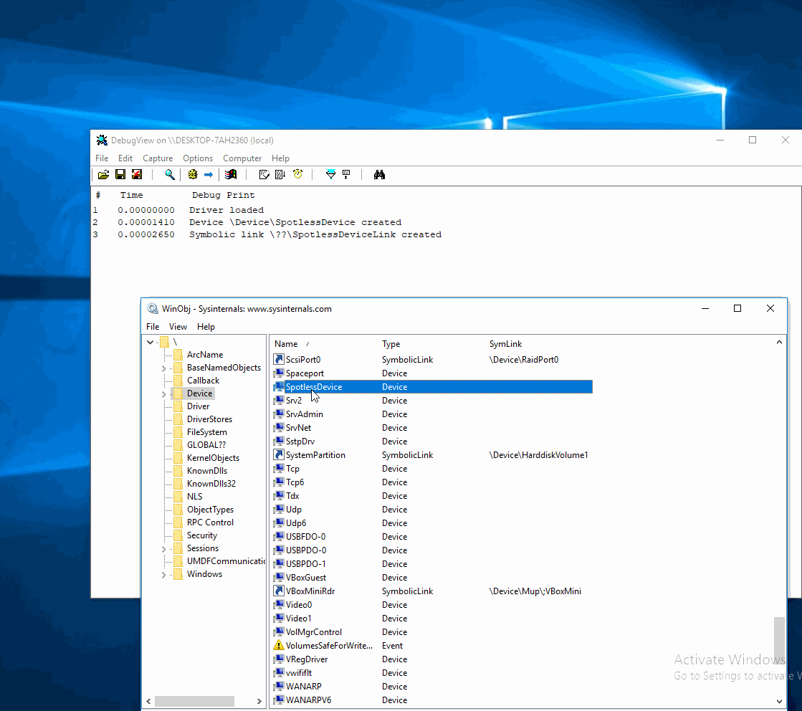
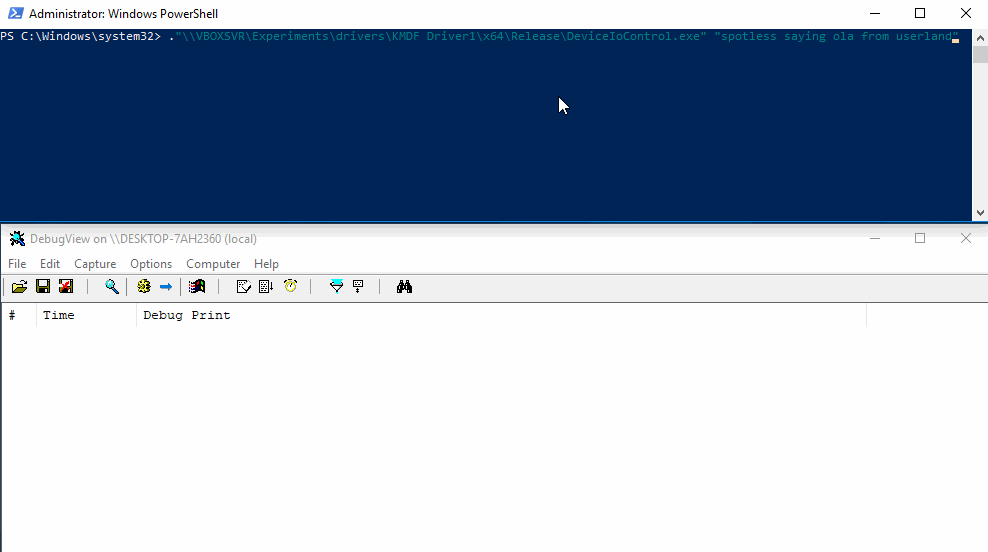

# Sending Commands From Your Userland Program to Your Kernel Driver using IOCTL

This is a quick exercise that demonstrates how to:

* Create a simple WDM kernel mode driver, that can receive and respond to a custom defined input/output control code (IOCTL) sent in from a userland program
* Create a simple userland program that can sent a custom defined IOCTL to the kernel driver
* Pass some data from the userland program to the kernel driver via `DeviceIoConctrol`
* Pass some data back from the kernel to the userland program

Below are the key code snippets that will make our kernel driver and the userland program.

## Kernel Driver

### Populating DriverObject with IRP Callback Routines

Inside driver's entry function, we populate our driver object with pointers to important routines that will be executed, for example, when the driver is unloaded or a handle to its device's symbolic link is obtained (`IRP_MJ_CREATE`) or closed (`IRP_MJ_CLOSE`):

.png>)

This is required, because these driver functions (callbacks) will be called by the OS when those events (i.e a userland application trying to obtain a handle to our device, unload the driver or close device's handle) will fire. We do not want the OS to not know what to do with our driver when those events fire, therefore we tell it.

### Creating Device and its Symbolic Link

This is where we create a device (that we are writing the driver for) and its symbolic link. The symbolic link is required for when we want to access our driver from the userland (by opening a handle to the device by calling `CreateFile`) and ask it to execute some code in respose to our custom defined IOCTL:

.png>)


* IOCTL control code is a code that is sent to the device driver from via an `RP_MJ_DEVICE_CONTROL` request using `DeviceIoControl` WinAPI.&#x20;
* IOCTL control code tells the driver what action the driver needs to perform.&#x20;
* For example, IOCTL code 0x202 (`IOCTL_STORAGE_EJECT_MEDIA`) could be sent to a USB/CDROM device and its  driver would carry out an appropriate action for the given device, i.e open the CD tray for a CD-ROM or eject the USB media storage.


Below shows the device name and its symbolic link we are using in this exercise:

.png>)

After the device and its symbolic links are created, the newly created device `SpotlessDevice` is now visible inside WinObj:

.png>)

Additionally, we can see the symbolic link `SpotlessDeviceLink` pointing to our device `\Device\SpotlessDevice`:

.png>)

### MajorFunctions

This function will handle IRPs that request (`CreateFile`) or close (`CloseHandle`) the handle to our  device `\Device\SpotlessDevice` through the symbolic link `\\.\SpotlessDeviceLink`:

.png>)

Below shows how IRP requests `IRP_MJ_CREATE` (for obtaining a handle to `\Device\SpotlessDevice` through the symbolic link) and `IRP_MJ_CLOSE` (for closing the handle) are hit when we double click the `SpotlessDevice` in WinObj:



### HandleCustomIOCTL

This routine will handle the IOCTL requests sent from our userland program. In this exercise, when it receives an IOCTL code for `IOCTL_SPOTLESS`, it will print a string that will come from our userland program's commandline argument. Additionally, it will send back a string for the userland program to print out:

.png>)


When `IoDeviceControl` is called in the userland with a custom IOCTL and any input data that we want to be sent to the kernel, the OS intercepts that request and packages it into an I/O Packet (IRP), that will then be handed to our callback `HandleCustomIOCTL`, that we previously registered in the `DriverEntry` routine for the IRP `IRP_MJ_DEVICE_CONTROL`.&#x20;

IRP, among many other things, contains the incoming IOCTL code, the input data sent from the userland request and a buffer that the kernel driver code can use to send the response back to the userland program.


### Defining Custom IOCTL

* IOCTL code needs to be defined both in the kernel driver as well as in the userland program
* IOCTL code is usually defined with a macro [`CTL_CODE`](https://docs.microsoft.com/en-us/windows-hardware/drivers/kernel/defining-i-o-control-codes).&#x20;
* Microsoft suggests that you can use any code starting from 0x800:

.png>)

## Userland Program

Below is the userland code that obtains a handle to the device `\Device\SpotlessDevice` via its symbolic link `\\.\SpotlessDeviceLink`, that we created earlier inside the driver's `DriverEntry` routine:

.png>)

Issuing a custom defined IOCTL to the driver and sending it a pointer to the string that comes as a commandline argument to our userland program, by calling `DeviceIoControl`:

.png>)

Additionally, the above code prints out the string received from the kernel.

## Demo

Below shows how:

1. We execute our userland program with a string `spotless saying ola from userland` as an argument&#x20;
2. That argument is sent to the kernel driver via our custom defined IOCTL `IOCTL_SPOTLESS`&#x20;
3. The kernel sents back some data to the userland program
4. The userland program receives text back from the kernel and prints it in DbgView



## Code

* `driver.c` is the driver code that receives and responds to IOCTL requests sent from the userland and send some data back to the userland program
* `userland.cpp` is the userland program sending IOCTL and receiving data from the kernel driver




```cpp
#include <wdm.h>

DRIVER_DISPATCH HandleCustomIOCTL;
#define IOCTL_SPOTLESS CTL_CODE(FILE_DEVICE_UNKNOWN, 0x2049, METHOD_BUFFERED, FILE_ANY_ACCESS)
UNICODE_STRING DEVICE_NAME = RTL_CONSTANT_STRING(L"\\Device\\SpotlessDevice");
UNICODE_STRING DEVICE_SYMBOLIC_NAME = RTL_CONSTANT_STRING(L"\\??\\SpotlessDeviceLink");

void DriverUnload(PDRIVER_OBJECT dob)
{
	DbgPrint("Driver unloaded, deleting symbolic links and devices");
	IoDeleteDevice(dob->DeviceObject);
	IoDeleteSymbolicLink(&DEVICE_SYMBOLIC_NAME);
}

NTSTATUS HandleCustomIOCTL(PDEVICE_OBJECT DeviceObject, PIRP Irp)
{
	UNREFERENCED_PARAMETER(DeviceObject);
	PIO_STACK_LOCATION stackLocation = NULL;
	CHAR *messageFromKernel = "ohai from them kernelz";

	stackLocation = IoGetCurrentIrpStackLocation(Irp);
	
	if (stackLocation->Parameters.DeviceIoControl.IoControlCode == IOCTL_SPOTLESS)
	{
		DbgPrint("IOCTL_SPOTLESS (0x%x) issued", stackLocation->Parameters.DeviceIoControl.IoControlCode);
		DbgPrint("Input received from userland: %s", (char*)Irp->AssociatedIrp.SystemBuffer);
	}

	Irp->IoStatus.Information = strlen(messageFromKernel);
	Irp->IoStatus.Status = STATUS_SUCCESS;
	
	DbgPrint("Sending to userland: %s", messageFromKernel);
	RtlCopyMemory(Irp->AssociatedIrp.SystemBuffer, messageFromKernel, strlen(Irp->AssociatedIrp.SystemBuffer));
	
	IoCompleteRequest(Irp, IO_NO_INCREMENT);

	return STATUS_SUCCESS;
}

NTSTATUS MajorFunctions(PDEVICE_OBJECT DeviceObject, PIRP Irp)
{
	UNREFERENCED_PARAMETER(DeviceObject);

	PIO_STACK_LOCATION stackLocation = NULL;
	stackLocation = IoGetCurrentIrpStackLocation(Irp);

	switch (stackLocation->MajorFunction)
	{
	case IRP_MJ_CREATE:
		DbgPrint("Handle to symbolink link %wZ opened", DEVICE_SYMBOLIC_NAME);
		break;
	case IRP_MJ_CLOSE:
		DbgPrint("Handle to symbolink link %wZ closed", DEVICE_SYMBOLIC_NAME);
		break;
	default:
		break;
	}
	
	Irp->IoStatus.Information = 0;
	Irp->IoStatus.Status = STATUS_SUCCESS;
	IoCompleteRequest(Irp, IO_NO_INCREMENT);

	return STATUS_SUCCESS;
}

NTSTATUS DriverEntry(PDRIVER_OBJECT DriverObject, PUNICODE_STRING RegistryPath) 
{
	UNREFERENCED_PARAMETER(DriverObject);
	UNREFERENCED_PARAMETER(RegistryPath);
	
	NTSTATUS status	= 0;

	// routine that will execute when our driver is unloaded/service is stopped
	DriverObject->DriverUnload = DriverUnload;
	
	// routine for handling IO requests from userland
	DriverObject->MajorFunction[IRP_MJ_DEVICE_CONTROL] = HandleCustomIOCTL;
	
	// routines that will execute once a handle to our device's symbolik link is opened/closed
	DriverObject->MajorFunction[IRP_MJ_CREATE] = MajorFunctions;
	DriverObject->MajorFunction[IRP_MJ_CLOSE] = MajorFunctions;
	
	DbgPrint("Driver loaded");

	IoCreateDevice(DriverObject, 0, &DEVICE_NAME, FILE_DEVICE_UNKNOWN, FILE_DEVICE_SECURE_OPEN, FALSE, &DriverObject->DeviceObject);
	if (!NT_SUCCESS(status))
	{
		DbgPrint("Could not create device %wZ", DEVICE_NAME);
	}
	else 
	{
		DbgPrint("Device %wZ created", DEVICE_NAME);
	}

	status = IoCreateSymbolicLink(&DEVICE_SYMBOLIC_NAME, &DEVICE_NAME);
	if (NT_SUCCESS(status))
	{
		DbgPrint("Symbolic link %wZ created", DEVICE_SYMBOLIC_NAME);
	}
	else
	{
		DbgPrint("Error creating symbolic link %wZ", DEVICE_SYMBOLIC_NAME);
	}
	
	return STATUS_SUCCESS;
}
```




```cpp
#include <iostream>
#include <Windows.h>

#define IOCTL_SPOTLESS CTL_CODE(FILE_DEVICE_UNKNOWN, 0x2049, METHOD_BUFFERED, FILE_ANY_ACCESS)

int main(char argc, char ** argv)
{
    HANDLE device = INVALID_HANDLE_VALUE;
    BOOL status = FALSE;                 
    DWORD bytesReturned = 0;
    CHAR inBuffer[128] = {0};
    CHAR outBuffer[128] = {0};

    RtlCopyMemory(inBuffer, argv[1], strlen(argv[1]));
    
    device = CreateFileW(L"\\\\.\\SpotlessDeviceLink", GENERIC_ALL, 0, 0, OPEN_EXISTING, FILE_ATTRIBUTE_SYSTEM, 0);
    
    if (device == INVALID_HANDLE_VALUE)
    {
        printf_s("> Could not open device: 0x%x\n", GetLastError());
        return FALSE;
    }

    printf_s("> Issuing IOCTL_SPOTLESS 0x%x\n", IOCTL_SPOTLESS);
    status = DeviceIoControl(device, IOCTL_SPOTLESS, inBuffer, sizeof(inBuffer), outBuffer, sizeof(outBuffer), &bytesReturned, (LPOVERLAPPED)NULL);
    printf_s("> IOCTL_SPOTLESS 0x%x issued\n", IOCTL_SPOTLESS);
    printf_s("> Received from the kernel land: %s. Received buffer size: %d\n", outBuffer, bytesReturned);

    CloseHandle(device);
}
```



## References

{% embed url="https://www.osronline.com/article.cfm%5Eid=92.htm" %}








